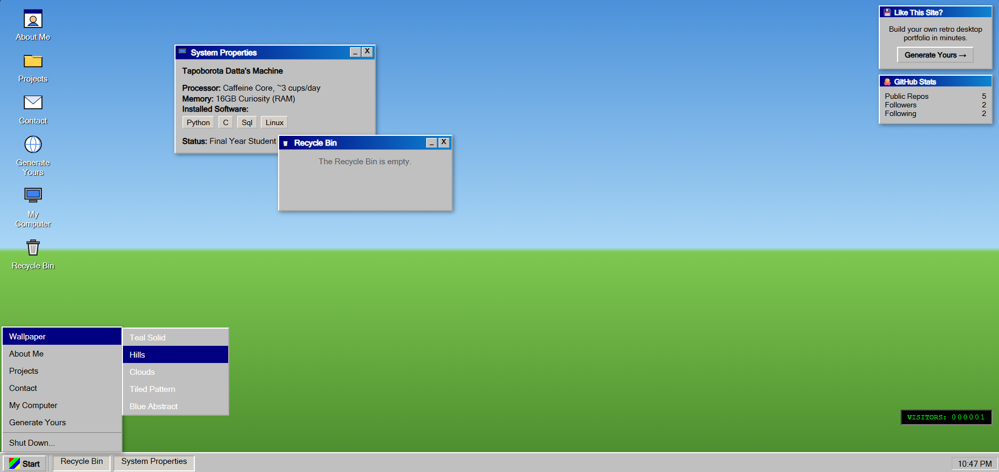
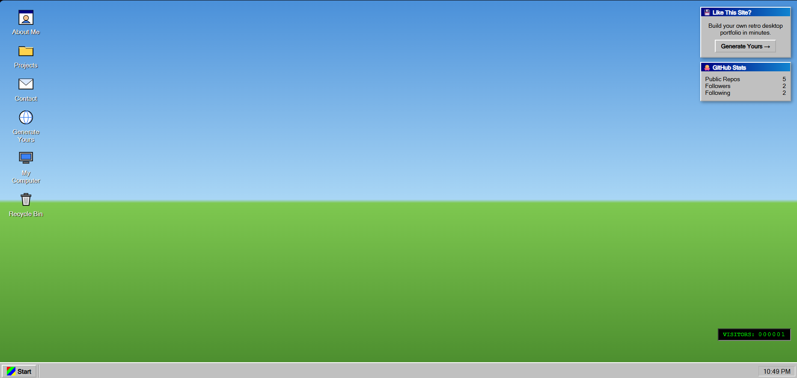
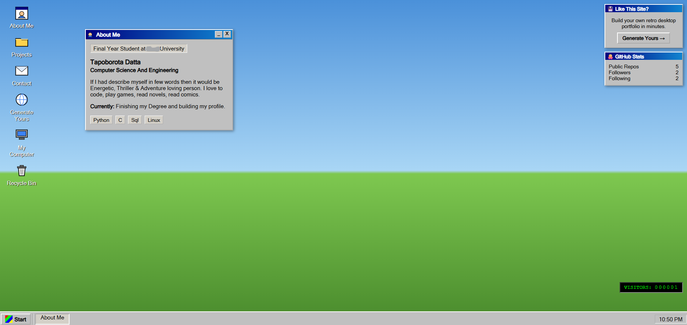
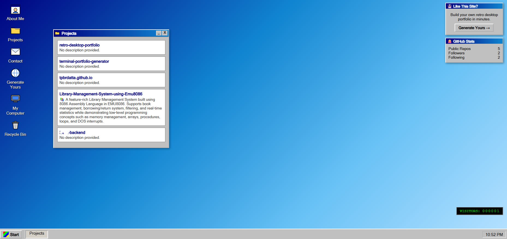
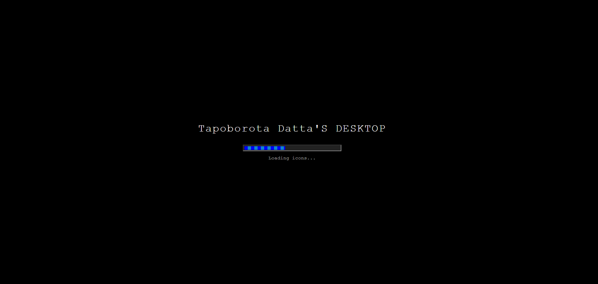

<div align="center">

# 🖥️ Retro Desktop Portfolio

### Fork it. Fill one form. Boot up your own desktop.


<br>



<br>

[](../../actions)
[](../../stargazers)
[](../../forks)
[](LICENSE)

</div>

---

## 🌈 What is this?

A **fully interactive Windows-95-style desktop** that boots up in a browser and doubles as your portfolio. No manual HTML editing, no server, no dashboard — just a GitHub Issue and a workflow that does the rest.

<table>
<tr>
<td width="33%" align="center">🧩 <b>Zero-code setup</b><br><sub>Fork → fill a form → done</sub></td>
<td width="33%" align="center">🪟 <b>Real desktop UX</b><br><sub>Draggable windows, taskbar, Start menu</sub></td>
<td width="33%" align="center">📊 <b>Live data</b><br><sub>Real-time GitHub repos & stats</sub></td>
</tr>
</table>

---

## 🖱️ What's actually on the desktop

- 🖼️ **Boot screen** — a striped progress bar and loading captions before the desktop appears
- 🪟 **Draggable, closable, minimizable windows** — About Me, Projects, Contact, My Computer, Recycle Bin
- 📁 **Live GitHub Projects** — your repos are fetched straight from the GitHub API, not hardcoded
- 🎨 **5 switchable wallpapers** — Teal Solid, Hills, Clouds, Tiled Pattern, Blue Abstract — changeable live from the Start menu *or* a right-click → Properties, and remembered across visits
- 🖱️ **Right-click desktop menu** — Arrange Icons, Refresh, Properties
- 🔌 **Shut Down flow** — fades to the classic "It's now safe to turn off your computer" screen
- 📌 **Fixed widgets** — a "Generate Yours" call-to-action panel and a live GitHub stats card, both pinned top-right so the desktop never feels empty
- 🔢 **Retro visitor counter** — the classic 90s green-on-black digit counter (see note below)
- 🚀 **"Generate Yours" shortcut** — a desktop icon, Start menu entry, and widget button, all linking straight to a pre-filled issue form so visitors can spin up their own

> **Note on the visitor counter:** this is a static site with no backend, so the counter increments per-browser via `localStorage` rather than tracking real global visits. It's period-accurate in spirit — plenty of real 90s counters were exaggerated too — but it isn't a live analytics feed.

---

## 🛣️ Setup

<table>
<tr>
<td width="50%" valign="top">

### 🎨 Path A — No Code

*Perfect if you've never touched a terminal.*

1. **Fork** this repo (top right ↗️)
2. `Settings → Actions → General → Workflow permissions` → enable **Read and write**
3. `Issues → Labels → New label` → create a label named exactly **`profile-setup`**
   *(GitHub won't auto-apply a label from the issue form unless it already exists in the repo — this step is easy to miss on a fresh fork)*
4. `Issues → New Issue` → pick **"🚀 Create/Update My Portfolio"** → fill in your details → submit
5. Check the **Actions** tab — once the run is green, a `gh-pages` branch will exist for the first time
6. *Now* go to `Settings → Pages` → source: **Deploy from a branch** → `gh-pages` → `/ (root)`
7. Give GitHub Pages a minute or two to publish, then refresh the Pages settings page for your live URL

✅ Live shortly after your first successful run.

</td>
<td width="50%" valign="top">

### 🧙 Path B — Developer

*For anyone who wants to test locally before pushing.*

```bash
git clone https://github.com/YOUR-USERNAME/retro-desktop-portfolio.git
cd retro-desktop-portfolio

ISSUE_BODY='### Full Name

Your Name

### Job Title / Core Focus

Your Title
...' node scripts/parse-issue.js

open index.html
```

Edit `template.html` for layout/style changes, `scripts/parse-issue.js` for parsing logic. Push, and the Action deploys it.

</td>
</tr>
</table>

---

## ⚙️ How it works

```mermaid
flowchart LR
    A[📝 Issue submitted] --> B[🏷️ Labeled profile-setup]
    B --> C[🤖 GitHub Actions triggered]
    C --> D[📜 parse-issue.js parses the form]
    D --> E[🖼️ Tokens stamped into template.html]
    E --> F[📦 Pushed to gh-pages]
    F --> G[🌐 Live on GitHub Pages]

    style A fill:#8A2BE2,color:#fff
    style B fill:#EC4899,color:#fff
    style C fill:#2088FF,color:#fff
    style D fill:#F7DF1E,color:#000
    style E fill:#3776AB,color:#fff
    style F fill:#FFD700,color:#000
    style G fill:#32CD32,color:#000
```



There's no backend and no database — just GitHub's own primitives, chained together. An issue form is really a structured questionnaire; the moment it's labeled `profile-setup`, the Action runs `scripts/parse-issue.js`, which regex-parses the issue body, resolves your chosen default wallpaper to a CSS class, builds your tech-stack chips and social link cards, and stamps everything into `template.html` as `index.html`. That gets pushed to `gh-pages`, and GitHub Pages serves it from there. Your GitHub repos and stats aren't baked in at build time at all — the deployed page fetches those live from the GitHub API whenever someone opens the Projects window or loads the page.

---

## 🧰 Customizing your form

The **Social Links** field accepts as many platforms as you want, one per line:

```
LinkedIn: your-handle
X: your-handle
Instagram: your-handle
Website: https://yourdomain.com
```

The **Default Wallpaper** field only sets what visitors see first — anyone can switch it live from the Start menu or right-click → Properties, and their choice is remembered on their own device.

---

## 🖼️ Preview

<table>
  <tr>
    <td align="center" width="50%">
      <br>
      <sub>🖥️ <b>Idle Desktop</b> — icons, wallpaper, and the pinned widgets</sub>
    </td>
    <td align="center" width="50%">
      <br>
      <sub>👤 <b>About Me</b> — bio, status, and tech stack chips</sub>
    </td>
  </tr>
  <tr>
    <td align="center" width="50%">
      <br>
      <sub>📁 <b>Projects</b> — live GitHub repos, fetched in real time</sub>
    </td>
    <td align="center" width="50%">
      <br>
      <sub>⏳ <b>Boot Screen</b> — the loading sequence before the desktop appears</sub>
    </td>
  </tr>
</table>

*(replace these with your own screenshots once your portfolio is live — see below for exactly what to capture)*

**What to capture, and where to save each one** (all inside an `assets/` folder at the repo root):

| Filename | What to show |
|---|---|
| `assets/desktop-full.png` | Hero shot at the top of this README — desktop with a couple of windows open, wallpaper visible, widgets visible |
| `assets/desktop-idle.png` | Clean idle desktop, no windows open — icons + wallpaper + widget stack + visitor counter all visible |
| `assets/about-window.png` | The About Me window open, ideally with real bio/tech-stack content filled in |
| `assets/projects-window.png` | The Projects window open after your real GitHub repos have loaded |
| `assets/boot-screen.png` | The boot screen mid-progress (refresh the page and screenshot quickly, or slow down the timers in `template.html` temporarily to catch it) |

Any image format works (`.png` recommended for crisp UI edges), and you can rename/reduce the list — just keep the `` paths in this README pointing at whatever you actually save.

---

## 🗺️ Roadmap

- [ ] 🎨 More wallpaper options
- [ ] 🖱️ Icon drag-and-drop repositioning (currently fixed order)
- [ ] 📂 File Explorer-style window for browsing projects instead of a flat list
- [ ] 🧠 Bring back an interactive quiz window

---

<div align="center">

### 🚀 [Fork this repo →](../../fork)

**built with**    

</div>